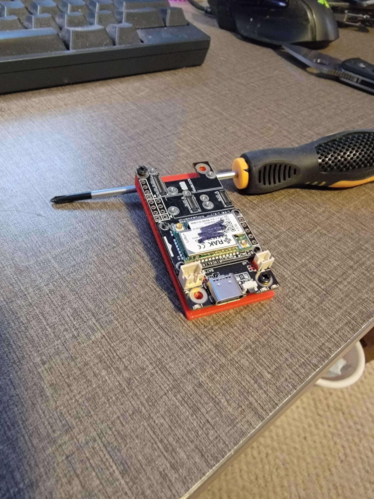
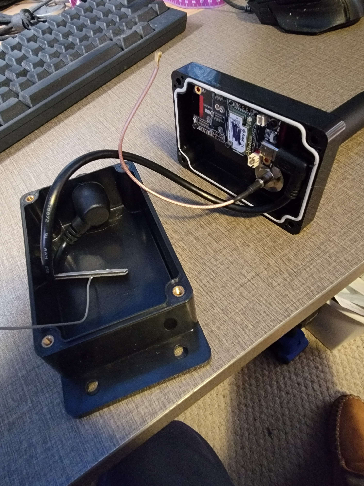
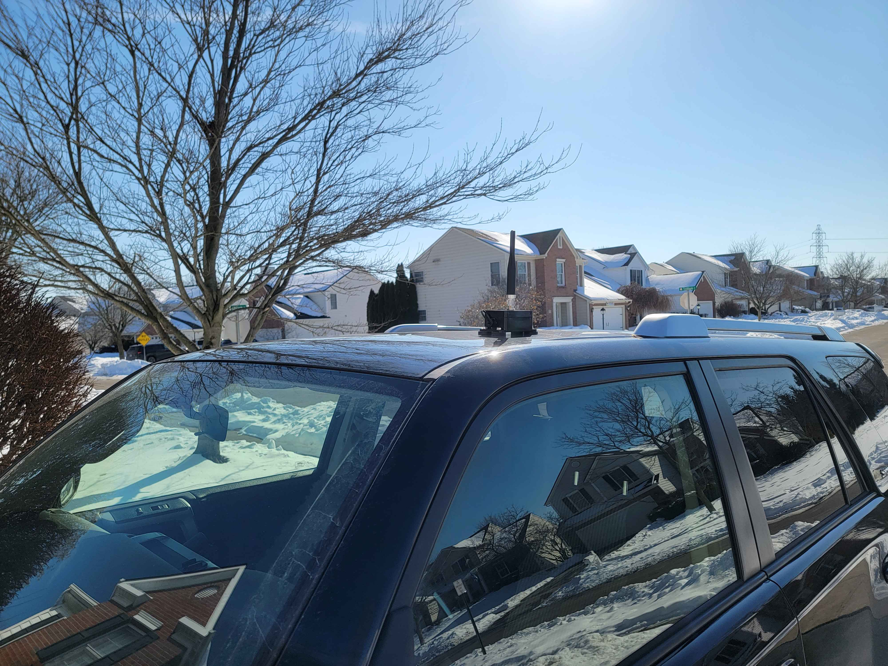

I've been getting into [MeshCore](https://meshcore.net/) — a LoRa mesh networking protocol that runs on RAK WisBlock hardware. I already have a repeater running on the second floor of my house with a 5dBi antenna, but I wanted something mobile. Something I could slap on my truck and extend the mesh wherever I go.

I was inspired by this [Meshtastic Magnetic Roof Node Build](https://www.youtube.com/watch?v=VyefujxTD6g&t=330s) video and decided to build my own version using MeshCore.

Here's how that build came together in about two days.

## The Plan

The concept is simple: a self-contained, weatherproof box with a RAK19007 base board, RAK4631 LoRa module, battery, and antenna — mounted to the truck roof with magnets. No drilling into the vehicle, no permanent modifications. Grab it, stick it on the roof, and go.

**Parts list:**
- RAK19007 WisBlock base board + RAK4631 LoRa module
- 1800mAh battery (gets ~3 days of runtime — LoRa sips power)
- Weatherproof junction box with gasket seal
- N-type female antenna connector
- U.FL to N-type female pigtail cable (RG178)
- 5dBi LoRa antenna with magnetic mount
- USB pass-through for charging
- Strong magnets for vehicle mounting
- 3D printed mounting plate (the fun part)

## Designing the Mount

The RAK19007 board is 30x60mm with four M2 mounting holes. Sounds simple — until you measure them and discover the holes aren't symmetrical. The top-left hole sits 2mm from the edges while the other three are 4mm in. Classic PCB design quirk.

I used [OpenSCAD](https://openscad.org/) to design a mounting plate with raised standoffs for airflow and matching screw holes. The first version used estimated measurements, and predictably, the holes didn't line up.

Once my calipers arrived, I re-measured and updated the design:

```openscad
// Mounting holes - the asymmetric surprise
hole_positions = [
    [2,  60 - 2],     // Top left: 2mm inset (the oddball)
    [30 - 4, 60 - 4], // Top right: 4mm inset
    [4, 4],            // Bottom left: 4mm inset
    [30 - 4, 4]        // Bottom right: 4mm inset
];
```

The updated print fit perfectly — diagonal screws seated on the first try.




## Choosing the Right Material

I prototyped in PLA to verify the fit, but this thing is going on a truck roof in Virginia. Summer interior temperatures can easily hit 60-70°C, and PLA starts softening around 50-55°C. PETG was the obvious choice — it handles heat much better and is still easy to print.

I went with red PETG. Partly for visibility inside the junction box during troubleshooting, partly because it matches the lobster energy. 🦞

## The Junction Box Build

The junction box has a gasket seal to keep moisture out. I drilled holes for:
- **N-type antenna bulkhead** — the antenna connector passes through the box wall so the external antenna cable connects without opening the enclosure
- **USB pass-through** — for charging the battery without disassembly

The mounting plate attaches to the inside of the junction box lid with double-sided tape. When you open the lid, the board comes with it — easy access for maintenance.



## The U.FL Problem

The one persistent annoyance was U.FL connectors. These tiny snap-on RF connectors are designed for static internal connections, not for anything that vibrates. In a truck, they'd pop off constantly.

The solution: mount the N-type connector as a bulkhead through the junction box wall, then run a short pigtail from the board's U.FL port to the bulkhead. All the mechanical stress lands on the threaded N-type connector instead of the fragile U.FL. A dab of hot glue on the U.FL end as extra insurance, and it's not going anywhere.

I initially had a 6-inch pigtail which was too tight — barely enough slack for routing. A 12-inch cable gives room for a service loop and proper strain relief.

## The AI-Assisted Workflow

I should mention: my AI assistant helped design the OpenSCAD mounting plate, suggested the PETG upgrade for heat resistance, and flagged the U.FL strain relief issue before I'd even thought about it. It's a weird but effective workflow — I describe what I'm building, it helps with the design math and material choices, I do the physical work. Brains and hands.

The caliper measurements to OpenSCAD to STL to print pipeline was surprisingly smooth. Measure, update the parametric design, export, slice, print. When the fit is wrong, adjust a number and reprint. Total cost of iteration: a few cents of filament and 20 minutes of print time.

## Final Assembly

With the new board and 12-inch pigtail, the final assembly was straightforward:

1. Mount the RAK19007 + RAK4631 on the PETG plate
2. Connect the 1800mAh battery
3. Run the U.FL pigtail to the N-type bulkhead
4. Close the junction box (gasket seals it)
5. Attach the magnets to the base
6. Stick it on the truck roof, connect the antenna, done

The magnets are seriously strong — once it's on the roof, it's not coming off until you deliberately pull it. Highway speeds, rain, whatever. It stays.



## On the Road

It's now deployed and working. I can extend my local mesh network to anywhere I drive — errands, road trips, whatever. Combined with the fixed repeater at home, that starts to build real coverage. The beauty of mesh is that every node makes the network stronger.


Total build cost was under $100 for the enclosure and hardware (not counting the RAK board itself). Total build time: about two days from concept to road-ready. Not bad for a custom portable repeater.

---

*If you're building something similar, feel free to reach out. The OpenSCAD files are parametric — easy to adapt for different boards or enclosure sizes.*
