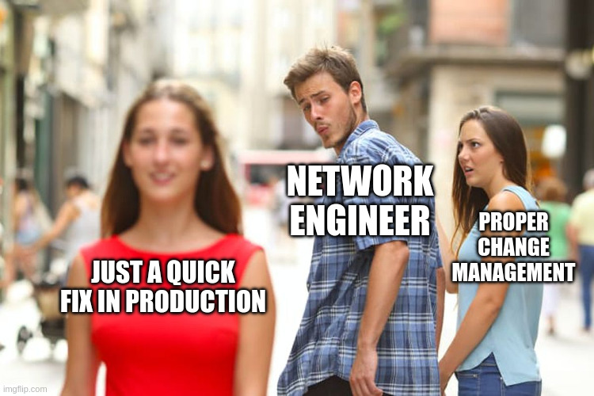
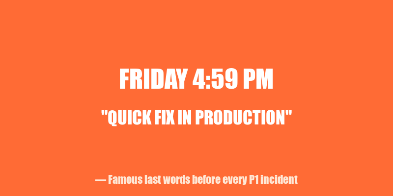
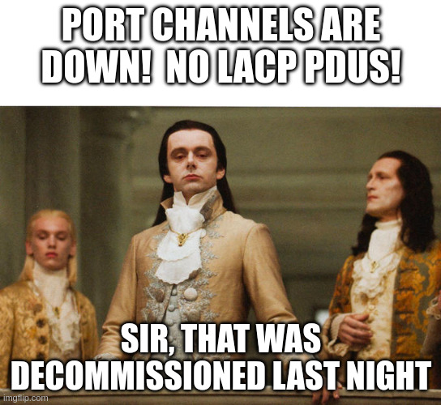
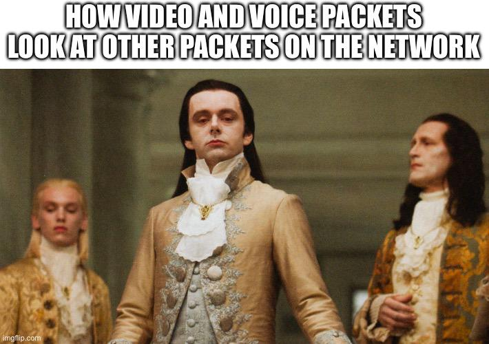
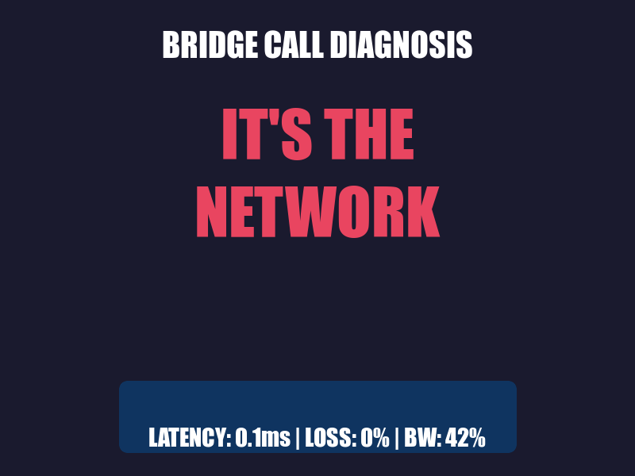
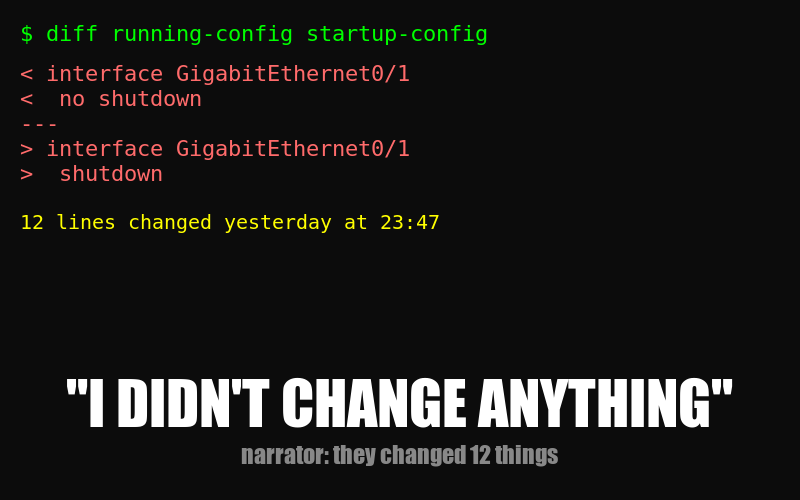
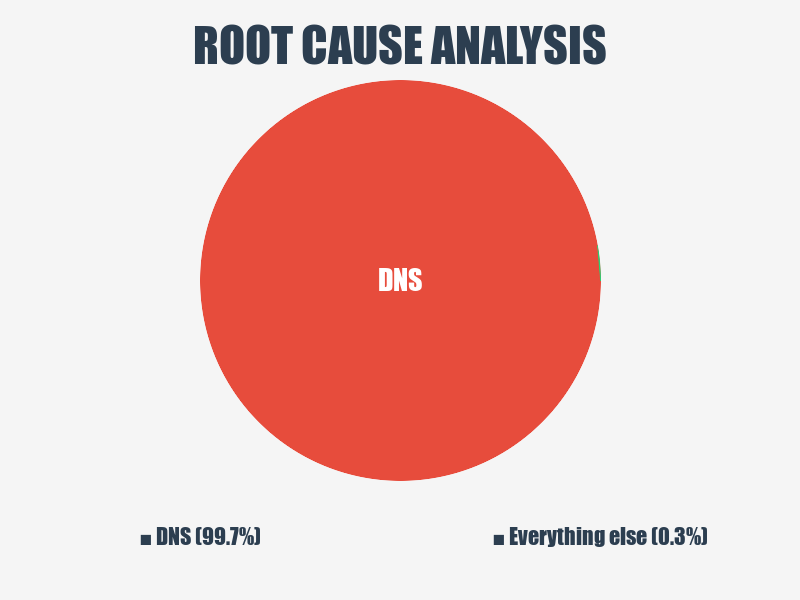

Network engineering is 10% configuring routers and 90% explaining to people why you can't "just add more bandwidth." The memes we share aren't just funny — they're coping mechanisms for the trauma of undocumented changes, 3 AM bridge calls, and users who swear they "didn't change anything."

Here are some of the best network memes making the rounds — and the painful, beautiful truth behind each one.

## The Distracted Boyfriend: Quick Fix vs. Change Management

You know the meme. The boyfriend (NETWORK ENGINEER) is turning his head toward the passing woman (JUST A QUICK FIX IN PRODUCTION) while his girlfriend (PROPER CHANGE MANAGEMENT) looks on in betrayal.

We've all been there. It's 4:47 PM on a Friday. Something's broken. The change window isn't until Tuesday. But you *know* it's just one command. One little `no shut`. What could go wrong?

Everything. Everything could go wrong.

The dirty secret of network engineering is that "quick fixes" are the number one source of outages. Not hardware failures. Not software bugs. Engineers who thought they'd be in and out in five minutes. The road to a P1 incident is paved with "I'll just document it later."

**The lesson:** Change management exists because past-you was also confident. Past-you was wrong.

## The Volturi: Unannounced Decommissions

Picture the Volturi from *Twilight* — ancient, regal vampires who have decided your fate before you even knew there was a trial. Now add the caption: "PORT CHANNELS ARE DOWN! NO LACP PDUs!" / "Sir, that was decommissioned last night."

This one hits different when you've spent two hours troubleshooting a circuit that no longer exists. You've checked the config. You've bounced the interface. You've opened a ticket with the carrier. You're starting to question your understanding of spanning tree.

Then someone casually mentions in a Teams chat that the server team decommissioned that rack last night. No change ticket. No notification. No email. Just... gone. Like it never existed.

The worst part? When you ask why there was no communication, you get: "Oh, we sent an email to the infrastructure distribution list." The one that gets 400 emails a day. The one nobody reads.

**The lesson:** If a tree falls in the forest and the change advisory board wasn't notified, it will absolutely take down production.

## QoS Royalty: Video Packets Looking Down on Everyone Else

The Volturi return — this time representing how video and voice packets look at other packets on the network. That aristocratic disdain? That's DSCP EF traffic walking past your best-effort HTTP downloads.

Quality of Service is one of those things that sounds simple in theory. Just mark the important traffic and prioritize it! In practice, it's a political nightmare. Every application owner thinks *their* traffic deserves priority. The video conferencing team wants EF marking. The database team wants assured forwarding. Karen from accounting wants her Spotify stream classified as business-critical.

And here's the real joke: half the time, QoS policies are configured on switches that never see congestion. You've spent three weeks in meetings arguing about queuing strategies for a 10 Gbps link running at 2% utilization.

But when congestion *does* hit? Those priority markings are the difference between a clean Webex call and your CEO looking like a Minecraft character in front of the board. So we configure it. We test it. We argue about it. And the EF packets continue their aristocratic march through the network, blissfully unaware of the peasant traffic being dropped behind them.

**The lesson:** QoS doesn't matter until it does. And when it does, you'll wish you'd spent more time on it.

## "It's Not a Network Problem"

No meme collection is complete without addressing the universal network engineer experience: everything is a network problem until proven otherwise.

Application slow? Network problem. Database timeout? Network problem. Coffee machine broken? Probably a network problem.

We've all sat on bridge calls where fifteen people from different teams are present, and the first ten minutes are spent explaining that 0.1ms latency and 0% packet loss means the network is fine. Then you watch in real time as someone discovers the application server has been running at 100% CPU for three days.

Does anyone apologize? Of course not. They just silently drop off the call. And next week, when something else breaks, the first ticket will be assigned to... the network team.

**The lesson:** Buy a packet capture tool. Learn to love Wireshark. Your innocence must be *provable*.

## The "I Didn't Change Anything" User

Narrator: *They changed something.*

This one transcends memes. It's a universal constant, like the speed of light or the fact that DNS is always the problem. A user will look you dead in the eye (or type it confidently in a ticket) and say "nothing changed on our end" while you're staring at config diffs that show twelve changes made yesterday.

The advanced version is "we made a change, but it shouldn't affect anything." That's network engineer for "we made a change and we have no idea what it affects."

**The lesson:** Trust, but verify. Then verify again. Then check the logs.

## It's Always DNS

There's a reason this joke never dies. Because DNS never stops being the problem.

You've been troubleshooting for an hour. You've checked routing tables, firewall rules, NAT translations, ACLs. You've traced packets through six hops. You've questioned your career choices. Then someone says "have you tried `nslookup`?" and suddenly everything unravels.

Stale cache. Wrong record. TTL that hasn't expired. CNAME pointing to a decommissioned host (see: Volturi, above). An `A` record that someone updated in the wrong zone file three weeks ago.

The pie chart doesn't lie: when you finally find root cause, it's DNS about 99.7% of the time. The other 0.3% is also DNS — you just haven't figured that out yet.

**The lesson:** When in doubt, flush the cache. When not in doubt, flush the cache anyway.

## Vendor Documentation: A Horror Story

Every network engineer remembers the moment they cracked open their first vendor documentation. You thought it would be approachable. Maybe even educational. Then you opened the Nokia SR OS CLI reference and realized it's 4,000 pages of commands that all look the same, written by someone who clearly hates you.

The three stages of vendor documentation:

1. **Optimism** — "Oh cool, let me just look up how to configure this."
2. **Confusion** — "Wait, why are there seven different ways to do this and none of them match the version I'm running?"
3. **Defeat** — *crying in shopping cart*

And it's not just Nokia. Cisco's configuration guides have more volumes than *Game of Thrones*. Juniper's documentation assumes you already know Juniper. Fortinet's docs are actually pretty good — which is suspicious and makes you trust them less.

The real skill in network engineering isn't configuring routers. It's knowing which page of a 6,000-page PDF has the one command you need, and accepting that the example config will never match your environment.

**The lesson:** If the documentation makes sense on the first read, you're reading the wrong documentation.

## Why We Meme

Network engineers meme because the alternative is screaming into the void at 2 AM while waiting for a TAC callback. These jokes aren't just funny — they're shared trauma, compressed into image macros. Every network engineer who sees the distracted boyfriend meme doesn't just laugh. They *remember*. They remember the time they made that quick fix. They remember the outage. They remember the post-mortem.

Memes are our oral tradition. They pass down wisdom that no Cisco Press book could capture: *don't touch production on Fridays, always check the change calendar, and never trust anyone who says "it's just a small change."*

Now if you'll excuse me, I need to go check why OSPF adjacencies are flapping. Someone probably "didn't change anything."

---

*What's your favorite network meme? The ones that hurt the most are usually the truest. Find me on [X/Twitter](https://x.com/SNetware50098) — I'm always down to trade war stories.*
